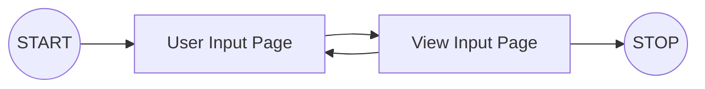
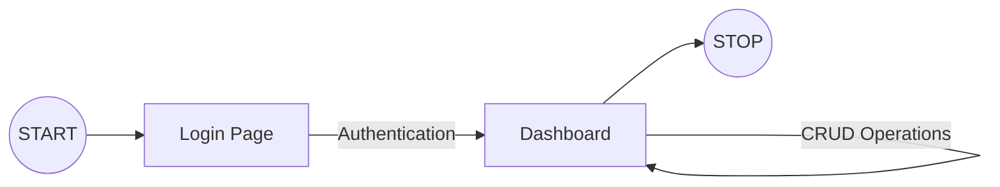

# Full Stack Developer Challenge

You have 2 challenges as part of this challenge series.

- Challenge 1: Create a form using PHP and display the form inputs on another page.
- Challenge 2: Create a project which would require authentication, after which the user is able to perform CRUD operations on the currencies and their exchange rates.

**Note:** Please clone the repository before you start the challenge. Please don't fork this repository, or create a pull request against it.

## Challenge 1 - PHP Challenge

### Workflow Overview

### Challenge Specifications

The main focus on this challenge is the User Experience. For this challenge, you are required to create a form where the user is required to input their - 

 - First Name
 - Last Name
 - Contact Number (Inclusive of optional country code)
 - Email
 - Website/LinkedIn Profile URL

It is important that the form comprises of the necessary validations for each type of input. You can use any frameworks where applicable.

## Challenge 2 - MERN Challenge

The main focus of this challenge is on the connection between the Frontend and the Backend systems. A good User Interface design is a bonus. 

### Workflow Overview

### Object Types

| Object/Table | Parameters  |
|--|--|
| **user** | username |
| | password |
| **currency** | base |
| | counter |
| | rate |

`currency.base` is the local/domestic currency

`currency.counter` is the foreign currency being compared against 

### Backend Challenge

For the backend part of the challenge, you would need to create a **Backend Server,** preferably with NodeJS, with database connection to your local **MySQL server**.

To create the database, use the `dev-challenge.mwb` file.
To import the data for the tables, use the `currency.csv` and `user.csv` files.

You would need to implement the APIs for authentication as well as perform the CRUD functions. 

### Frontend Challenge

For the frontend part of the challenge, you would need to create a User Interface. You can use any framework where applicable, preferably with **ReactJS** and **MaterialUI**. 

The minimum pages required for the User Interface are: 
 1. Login
 2. Dashboard

| Page | Requirement |
|--|--|
| Login | Authenticate user using username and password |
| Dashboard | Dashboard to view all currencies and perform CRUD functions  |
